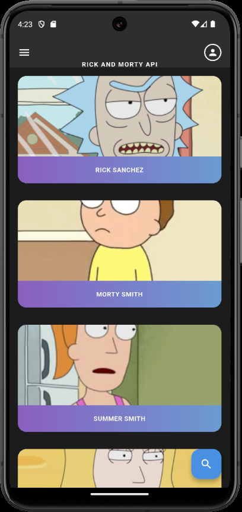

# Rick and Morty Portal 🛸

Um aplicativo Flutter desenvolvido como desafio técnico que consome a API do Rick and Morty para exibir personagens da série com uma interface moderna e responsiva.

## 📱 Funcionalidades Implementadas

### ✅ Funcionalidades Principais

- **Listagem de personagens**: Grid responsivo com imagens e nomes
- **Busca e filtros**: Pesquisa por nome, status, espécie e gênero
- **Paginação infinita**: Carregamento automático de mais personagens ao rolar
- **Detalhes do personagem**: Página dedicada com informações completas
- **Sistema de favoritos**: Salvar personagens favoritos localmente
- **Interface responsiva**: Adaptação para diferentes tamanhos de tela

### 🎨 Interface e UX

- **Tema escuro**: Design inspirado no universo Rick and Morty
- **Cards personalizados**: Layout com gradientes e sombras
- **Animações suaves**: Transições e loading states
- **Cache de imagens**: Performance otimizada com `cached_network_image`
- **Estados de loading**: Indicadores visuais durante carregamentos
- **Tratamento de erros**: Feedback visual para erros de conexão

## 🏗️ Arquitetura

O projeto segue uma arquitetura limpa e bem organizada:

```
lib/
├── main.dart                 # Ponto de entrada da aplicação
├── core/                     # Configurações centrais
│   ├── theme/               # Sistema de design (cores, estilos, dimensões)
│   └── utils/               # Utilitários e helpers
├── data/                     # Camada de dados
│   ├── models/              # Modelos de dados (Character, ApiResponse)
│   └── services/            # Serviços (API, Favoritos)
└── presentation/             # Camada de apresentação
    ├── pages/               # Páginas (Home, Detalhes, Favoritos)
    └── widgets/             # Widgets reutilizáveis
```

## 🔧 Tecnologias e Dependências

### Principais dependências:

```yaml
dependencies:
  flutter: sdk
  cupertino_icons: ^1.0.8
  shared_preferences: ^2.5.3 # Armazenamento local
  http: ^1.4.0 # Requisições HTTP
  cached_network_image: ^3.4.1 # Cache de imagens
  flutter_svg: ^2.2.0 # Suporte a SVG
```

### Características técnicas:

- **Flutter SDK**: ^3.8.1
- **Padrão Singleton**: Para serviços
- **Tratamento de exceções**: Try/catch com retry automático
- **Timeout personalizado**: 30 segundos para requisições
- **Persistência local**: SharedPreferences para favoritos

## 🚀 Como executar

### Pré-requisitos

- Flutter SDK (3.8.1 ou superior)
- Dart SDK
- Android Studio ou VS Code
- Emulador Android/iOS ou dispositivo físico

### Instalação e execução

1. **Clone o repositório**:

```bash
git clone https://github.com/kevyncode/kobe-challenge-kevyncode.git
cd kobe-challenge-kevyncode
```

2. **Instale as dependências**:

```bash
flutter pub get
```

3. **Execute o projeto**:

```bash
flutter run
```

### Comandos úteis:

```bash
# Verificar análise estática
flutter analyze

# Executar testes
flutter test

# Build para release
flutter build apk
```

## 🌐 API Integration

### Rick and Morty API

- **Base URL**: `https://rickandmortyapi.com/api`
- **Endpoints utilizados**:
  - `/character` - Lista de personagens
  - `/character/?name={name}` - Busca por nome
  - `/character/?status={status}` - Filtro por status

### Características da integração:

- ✅ Retry automático (até 3 tentativas)
- ✅ Timeout configurável (30s)
- ✅ Tratamento de erros de rede
- ✅ Verificação de disponibilidade da API
- ✅ Paginação com scroll infinito

## 🎯 Funcionalidades Detalhadas

### HomePage

- Grid de personagens com layout responsivo (2 colunas)
- Busca em tempo real com debounce
- Filtros por status, espécie e gênero
- Scroll infinito para carregamento de mais personagens
- Pull-to-refresh para atualização

### CharacterDetailPage

- Informações completas do personagem
- Status visual (vivo/morto/desconhecido)
- Lista de episódios onde aparece
- Sistema de favoritos integrado

### FavoritesPage

- Lista de personagens salvos como favoritos
- Sincronização com armazenamento local
- Possibilidade de remover favoritos

## 💻 Estado Atual do Desenvolvimento

### ✅ Implementado

- [x] Estrutura base do projeto
- [x] Integração com Rick and Morty API
- [x] Listagem de personagens
- [x] Sistema de busca e filtros
- [x] Página de detalhes
- [x] Sistema de favoritos
- [x] Design system completo
- [x] Tratamento de erros
- [x] Cache de imagens
- [x] Interface responsiva

### 🔄 Status dos Testes

- Projeto sem erros no `flutter analyze`
- Estrutura preparada para testes unitários

## 🎨 Design System

O projeto inclui um sistema de design completo e consistente:

### Cores

- **Primary**: #4A90E2 (azul característico)
- **Secondary**: #00D4AA (verde portal)
- **Background**: #1A1A1A (tema escuro)
- **Status colors**: Verde (vivo), Vermelho (morto), Cinza (desconhecido)

### Componentes

- `CharacterCard`: Card de personagem com gradiente
- `CustomAppBar`: AppBar personalizada com busca
- `SearchDialog`: Modal de filtros avançados
- `CharactersList`: Lista responsiva de personagens

## 📱 Screenshots

### Tela Principal

<div align="center">
  
</div>

_Interface moderna com tema escuro inspirado no universo Rick and Morty, exibindo personagens em cards com gradientes e layout responsivo._

---

**Desenvolvido por**: Kevyn Rodrigues
**Desafio técnico**: Kobe Apps
**Data**: Agosto 2025
