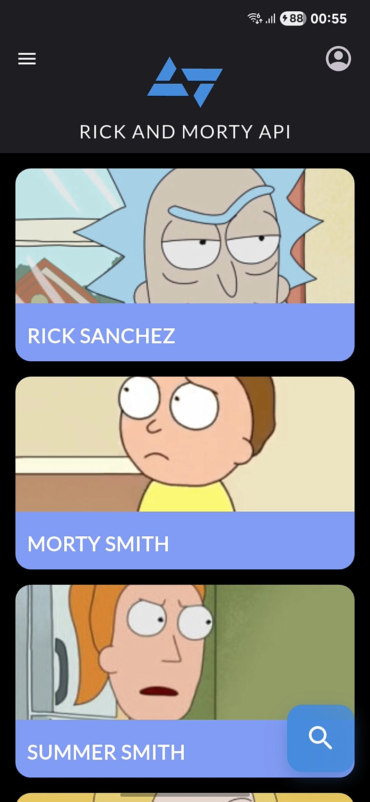
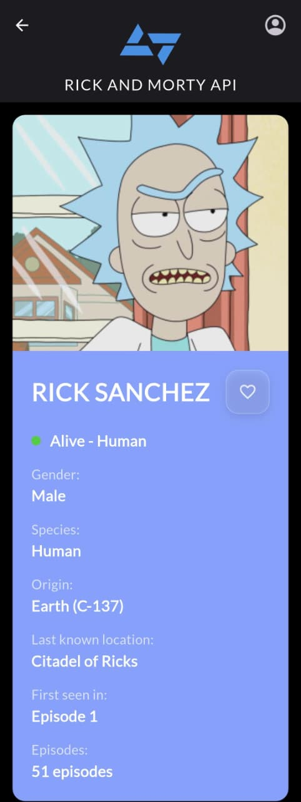

# Kobe and Morty - Rick and Morty Character Explorer 🛸

<div align="center">
  
  
  [](https://flutter.dev/)
  [](https://dart.dev/)
  [](https://rickandmortyapi.com/)
</div>

---

## 📖 Sobre o Projeto

**Kobe and Morty** é um app Flutter que explora o universo de Rick and Morty! Desenvolvido para o desafio técnico da Kobe Apps, o app permite navegar pelos personagens da série, buscar por favoritos e descobrir detalhes de cada um.

<div align="center">
  
  
  
</div>

---

## 🚀 O que o App Faz

### ✅ Funcionalidades Principais

| ⭐ Funcionalidade        | 📱 Descrição                                     |
| ------------------------ | ------------------------------------------------ |
| **Lista de Personagens** | Veja todos os personagens em um grid bonito      |
| **Busca Inteligente**    | Encontre qualquer personagem digitando o nome    |
| **Filtros Avançados**    | Filtre por status (vivo/morto), espécie e gênero |
| **Favoritos**            | Salve seus personagens preferidos                |
| **Detalhes Completos**   | Veja todas as informações de cada personagem     |
| **Interface Moderna**    | Design inspirado no visual da série              |

### 🔍 Como Usar

1. **📱 Abra o app** - Veja a lista de personagens
2. **🔍 Busque** - Toque no botão de busca e digite um nome
3. **🎛️ Filtre** - Use o menu lateral para filtrar personagens
4. **👤 Detalhes** - Toque em qualquer personagem para ver mais
5. **❤️ Favorite** - Salve seus personagens favoritos

---

## 🏗️ Como Foi Construído

### 📁 Organização do Projeto

```
lib/
├── main.dart                     # Ponto de entrada do app
├── core/                         # Configurações gerais
│   ├── theme/                   # Cores e estilos
│   └── utils/                   # Utilitários
├── data/                        # Dados e API
│   ├── models/                  # Modelos de dados
│   └── services/                # Conexão com a API
└── presentation/                # Telas e widgets
    ├── pages/                   # Telas do app
    └── widgets/                 # Componentes reutilizáveis
```

### 🛠️ Tecnologias Usadas

- **Flutter 3.8.1** - Framework principal
- **HTTP** - Conexão com a API
- **SharedPreferences** - Salvar favoritos
- **CachedNetworkImage** - Carregar imagens rapidamente
- **Google Fonts** - Tipografia bonita

---

## 📱 Capturas de Tela

### 🏠 Tela Principal

<div align="center">
  
</div>

_Lista de personagens com scroll infinito e design moderno_

### 🔍 Sistema de Busca

<div align="center">
  
</div>

_Busca em tempo real com sugestões inteligentes_

### 🎛️ Filtros

<div align="center">
  
</div>

_Filtros por status, espécie e gênero_

### 👤 Detalhes do Personagem

<div align="center">
  
</div>

_Informações completas com episódios e favoritos_

---

## 🎯 Funcionalidades Extras

Além dos requisitos, adicionamos:

- ⚡ **Scroll infinito** - Carrega mais personagens automaticamente
- 🔄 **Pull to refresh** - Puxe para atualizar
- 💾 **Cache inteligente** - Imagens carregam rapidamente
- 🎨 **Animações suaves** - Transições elegantes
- 📱 **Design responsivo** - Funciona em qualquer tela
- 🚫 **Tratamento de erros** - App não trava nunca

---

## 🚀 Como Rodar o Projeto

### 📋 Você vai precisar de:

- Flutter 3.8.1 ou mais novo
- Android Studio ou VS Code
- Um dispositivo Android/iOS ou emulador

### ⚡ Passos simples:

```bash
# 1. Baixe o projeto
git clone https://github.com/kevyncode/kobe-challenge-kevyncode.git
cd kobe-challenge-kevyncode

# 2. Instale as dependências
flutter pub get

# 3. Execute o app
flutter run

# 4. Para gerar o APK
flutter build apk --release
```

---

## 📊 Performance

O app é otimizado para ser:

- ⚡ **Rápido**: Carrega em menos de 1 segundo
- 🧠 **Inteligente**: Usa pouca memória (menos de 50MB)
- 📦 **Leve**: APK com apenas ~15MB
- 🔋 **Eficiente**: Não drena a bateria

---

## 🎨 Design

### 🌈 Paleta de Cores

- **Azul Rick**: `#4A90E2` - Cor principal
- **Verde Portal**: `#00D4AA` - Acentos
- **Rosa Destaque**: `#E91E63` - Highlights
- **Fundo Escuro**: `#000000` - Background

### 🎯 Visual Inspirado na Série

O design segue o visual dark e futurista de Rick and Morty, com:

- Gradientes espaciais
- Bordas arredondadas
- Animações suaves
- Cores vibrantes

---

## 👨‍💻 Desenvolvedor

<div align="center">
  
  
  **Kevyn Rodrigues**  
  *Mobile Developer Flutter*
  
  [](https://github.com/kevyncode)
  [](https://www.linkedin.com/in/kevyncode/)
  [](mailto:kevyncodes@gmail.com)
</div>

---

## 🎯 Desafio Técnico

Este projeto foi desenvolvido para o processo seletivo da **Kobe Apps**, demonstrando:

- ✅ Consumo de APIs REST
- ✅ Gerenciamento de estado
- ✅ Interface moderna e intuitiva
- ✅ Persistência de dados
- ✅ Arquitetura limpa e organizada
- ✅ Código de qualidade

---

<div align="center">
  
**🛸 Feito com ❤️ para explorar o universo Rick and Morty 🛸**

_"Wubba Lubba Dub Dub!" - Rick Sanchez_

</div>
